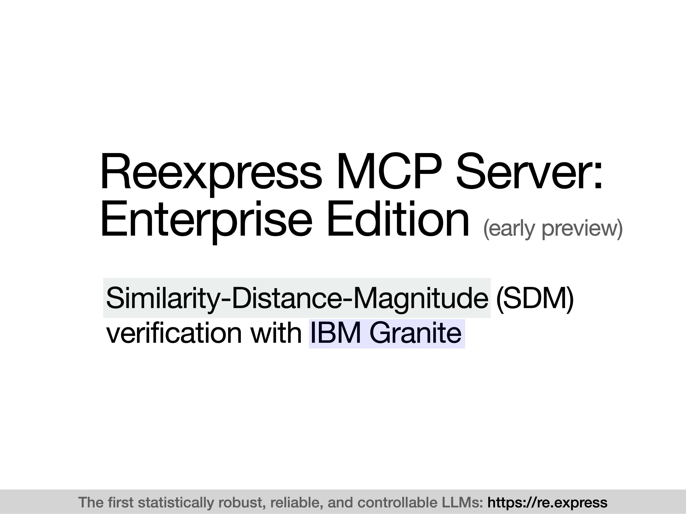

# Reexpress MCP Server: Adaptable SDM Verification with IBM Granite

### Video overview: [Here](https://www.youtube.com/watch?v=B6QuPkuDLBo)

[](https://www.youtube.com/watch?v=B6QuPkuDLBo)


Reexpress MCP Server is a drop-in solution to add state-of-the-art statistical verification to your complex LLM pipelines, as well as your everyday use of LLMs for search and QA for **software development and data science settings**. It's the first reliable, statistically robust AI second opinion for your AI workflows.

This early release version uses the IBM Granite-3.3-8b-instruct model to compose the output of multiple external LLMs, over which we then train an SDM estimator for robust verification of instruction following of the tool-calling LLM. This replaces the embedding API calls in our first released [MCP server](https://github.com/ReexpressAI/reexpress_mcp_server), providing the scaffolding to easily add a fine-tuned version of the model for your enterprise tasks. 


> [!NOTE]
> The SDM estimator included in the initial GitHub release file is a pre-release and is likely under-trained.

## Installation

See the [Readme](code/mcp_v2_preview/README.md) in the code repo, with the following additional notes about dependencies:

This version of the MCP server code works on Linux, so you can skip the installation of MLX. Rather than the conda environment provided in the code directory, you can create an environment as follows:

```
conda create -n mcp_v2_preview python=3.12
conda activate mcp_v2_preview
pip install torch transformers accelerate numpy==1.26.4
conda install -c pytorch faiss-cpu=1.9.0
pip install "mcp[cli]==1.6.0"
pip install openai==1.70.0
```

(Note in particular that the code is currently incompatible with NumPy 2.0.)

Additional documentation will be provided in the full release.
